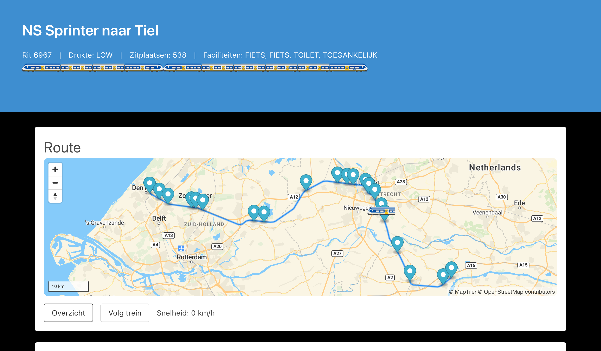

## NS Spoorkaart

Een kaart met alle treinen en stations van de NS api :)

## Features
Naast de kaart met alle treinen, kan je ook de stations zien (als je inzoomt). Je kan ook vertrek- en aankomsttijden en de hele reis van een trein zien.

## to do
- [ ] Storingen laten zien

## Screenshots
### Kaart

### Reis


## Zelf hosten
Om de kaart zelf te hosten kan je docker gebruiken (zie [docker-compose.yml](docker-compose.yml)) of gewoon in de terminal:

1. Dependencies installeren:
```sh
yarn
```
2. Frontent genereren met Next.js
```sh
yarn build
```
3. Server starten
```sh
yarn start
```